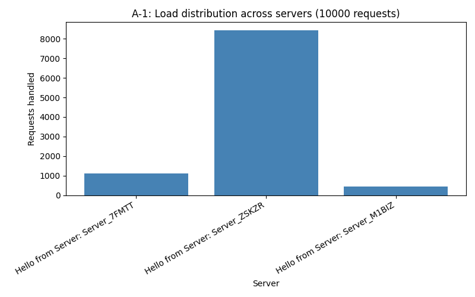
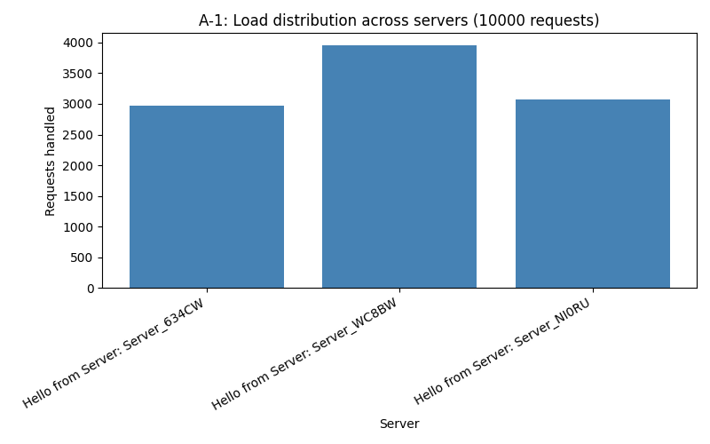
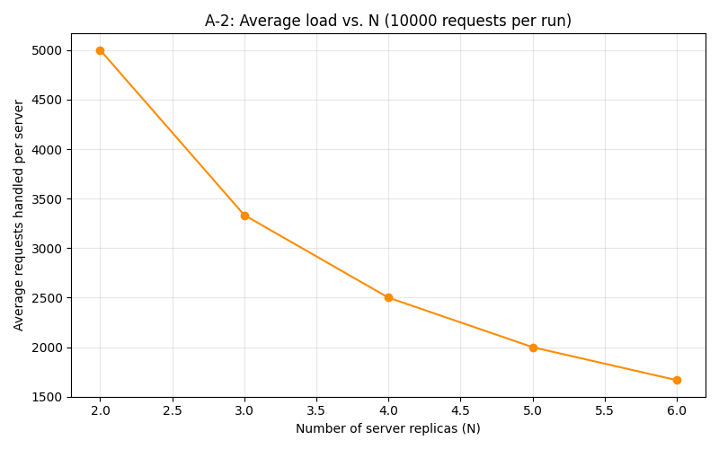

# Customizable Load Balancer - Distributed Systems

## Group Members
| Student ID | Name |
|------------|--------------------------|
| 146510 | Wanjiru Nicole Njeri |
| 170084 | Eyoel Abraham |
| 159056 | Marsa Fatma Omar |
| 167016 | Macharia Alysa Gathoni |

## Project Overview

This project implements a customizable load balancer for a distributed system using consistent hashing. The load balancer distributes incoming client requests across multiple replicated web servers while maintaining an approximately even load distribution. It also supports dynamic scaling through the addition and removal of server replicas, continuously monitors server health using heartbeat requests, and automatically replaces failed servers to maintain the configured number of replicas. The system is containerized using Docker and Docker Compose, making it easy to deploy and test in a distributed environment.

## Dependencies

The project requires the following software:

- Docker Engine
- Docker Compose v2
- Python 3.10 or later

Python packages used for the analysis scripts:

```bash
pip install aiohttp requests matplotlib
```

The Docker images automatically install the Python dependencies listed in the `requirements.txt` files for the server and load balancer.

## Architecture

- **Server (Task 1)**: Flask app, `/home` and `/heartbeat` on port 5000. `SERVER_ID`
  is injected as an environment variable at container launch so each replica can
  identify itself.
- **Consistent Hash Map (Task 2)**: `loadbalancer/consistent_hash.py`. Circular
  array of 512 slots. Each physical server gets `K = log2(512) = 9` virtual
  replicas placed via `Φ(i, j) = i² + j² + 2j + 25`. Requests are placed via
  `H(request_id) = request_id² + 2·request_id + 17`. Collisions (both server
  placement and request lookup) are resolved with **linear probing**, walking
  clockwise to the next free/occupied slot respectively.
- **Load Balancer (Task 3)**: Flask app + `docker-py` SDK. Runs `privileged: true`
  with the host's Docker socket mounted, so it can spawn/stop sibling containers
  directly (rather than shelling out to `docker` CLI via `os.popen`). A background
  thread polls each replica's `/heartbeat` every 5 seconds (configurable); on
  failure it removes the dead replica from the hash ring and spawns a
  randomly-named replacement to keep the fleet at N.

## Design choices

- **Integer server IDs vs. hostnames**: The hash functions need integer inputs,
  but hostnames are strings/container names. The load balancer assigns each
  server an internal auto-incrementing integer ID (independent of hostname) at
  add-time, and uses that ID as `i` in `Φ(i, j)`. This keeps hostnames free-form
  while satisfying the hash function's numeric input.
- **Random hostnames**: When `/add` or the auto-respawn logic needs a hostname
  and none is given, we generate `Server_<5 random alphanumeric chars>` to avoid
  collisions with existing container names.
- **Thread safety**: All ring/state mutations go through a single `RLock` since
  Flask's dev server + the heartbeat thread can touch shared state concurrently.
- **Only the load balancer is exposed** on `localhost:5000`; servers communicate
  over the internal `net1` Docker network using container-name DNS resolution.

## Assumptions

- Docker network is explicitly named `net1` (pinned in `docker-compose.yml`) so
  the load balancer's `NETWORK_NAME` env var reliably matches, regardless of the
  Compose project name prefix Docker would otherwise apply.
- The implementation follows the hash functions specified in the assignment for 
  request mapping and virtual server placement. The hash functions are isolated within 
  `consistent_hash.py`, making it straightforward to modify them for the analysis in Task A-4 without affecting the rest of the load balancer.
- `/rm` and `/add` treat an empty `hostnames` list as "let the load balancer pick
  names/victims automatically," consistent with the spec's wording that hostnames
  are "preferably set" but not required.

## Project Structure

```text
.
├── analysis/
│   ├── a1_load_distribution.py
│   ├── a2_scalability.py
│   └── a3_failure_recovery.py
│
├── loadbalancer/
│   ├── app.py                    # Load balancer implementation
│   ├── consistent_hash.py        # Assignment hash functions
│   ├── consistent_hash_modified.py
│   ├── consistent_hash_original.py
│   ├── test_consistent_hash.py
│   ├── Dockerfile
│   └── requirements.txt
│
├── server/
│   ├── app.py                    # Replica web server
│   ├── Dockerfile
│   └── requirements.txt
│
├── a1_load_distribution_modified.png
├── a1_load_distribution_original.png
├── a2_scalability_modified.png
├── a2_scalability_original.png
├── a3_failure_recovery_output.txt
├── docker-compose.yml
├── Makefile
└── README.md
```

### Running the project

Build the Docker images and start the load balancer:

```bash
make up
```
The Makefile uses `docker-compose.yml` to build the server and load balancer images, create the internal Docker network (`net1`), and launch the complete distributed system with the initial three server replicas.

Verify that the load balancer is running:

```bash
curl http://localhost:5000/rep
curl http://localhost:5000/home
```

To stop the project:

```bash
make down
```

To remove containers, images, and the Docker network:

```bash
make clean
```

## API Usage

### View active replicas

```bash
curl http://localhost:5000/rep
```

Example response:

```json
{
  "message": {
    "N": 3,
    "replicas": [
      "Server_6YSW0",
      "Server_8UZVY",
      "Server_D4XWJ"
    ]
  },
  "status": "successful"
}
```

---

### Route a request through the load balancer

```bash
curl http://localhost:5000/home
```

Example response:

```json
{
  "message": "Hello from Server: Server_D4XWJ",
  "status": "successful"
}
```

---

### Add new replicas

```bash
curl -X POST http://localhost:5000/add \
-H "Content-Type: application/json" \
-d '{
  "n": 2,
  "hostnames": ["S4", "S5"]
}'
```

Example response:
```json
{
  "message": {
    "N":5,
    "replicas":[
      "Server_6YSW0","Server_8UZVY","Server_D4XWJ","S4","S5"
    ]
  },
  "status":"successful"
}
```

---

### Remove replicas

```bash
curl -X DELETE http://localhost:5000/rm \
-H "Content-Type: application/json" \
-d '{
  "n": 1,
  "hostnames": ["S4"]
}'
```

Example response:
```json
{
  "message": {
    "N":4,
    "replicas":[
      "Server_6YSW0",
      "Server_8UZVY",
      "Server_D4XWJ",
      "Server_V0RO2"
    ]
  },
  "status":"successful"
}
```

---

### Invalid endpoint

```bash
curl http://localhost:5000/invalid
```

Expected response:

```json
{
  "message":"<Error> '/invalid' endpoint does not exist in server replicas",
  "status":"failure"
}
```

## Testing

1. **Unit test the hash map in isolation** (no Docker needed):
   ```bash
   make test-hash
   ```
   Verifies correct server placement, request routing, and consistent hash map rebalancing after a simulated server removal.

2. **Endpoint + failure recovery test** (`analysis/a3_failure_recovery.py`):
   Exercises `/rep`, `/home`, `/add`, `/rm`, an invalid path, then does
   `docker kill` on a live replica and times how long the load balancer takes
   to detect and respawn it.

3. **Load distribution** (`analysis/a1_load_distribution.py`): fires 10,000
   async requests at `/home` with N=3 and bar-charts the per-server count.

4. **Scalability** (`analysis/a2_scalability.py`): steps N from 2 to 6 via
   `/add`/`/rm`, re-runs the 10,000-request load test at each step, and line-
   charts average load per server.

Install analysis dependencies separately (these run on the host, not in Docker):
```bash
pip install aiohttp requests matplotlib
```

## Performance Analysis

### A-1: Load Distribution (N = 3)

**Original Hash Functions**



Using the original hash functions specified in the assignment, the load distribution was noticeably uneven. One server handled a significantly larger number of requests than the others due to clustering caused by the quadratic hash functions operating over a ring of 512 slots. Since only a subset of slot values are produced, requests tend to accumulate around certain regions of the ring instead of being distributed uniformly.

**Modified Hash Functions**



After replacing the request and virtual server hash functions with better-distributed multiplicative hash functions, the load became much more balanced. The three server replicas handled approximately **2889**, **3022**, and **4089** requests respectively out of 10,000 requests. Although the distribution is not perfectly equal, it is considerably more balanced than the original implementation, demonstrating that the new hash functions reduce clustering and improve load balancing.

---

### A-2: Scalability (N = 2 to N = 6)

**Original Hash Functions**



With the original hash functions, increasing the number of replicas reduced the average number of requests handled per server as expected. However, the distribution among individual servers remained uneven because of poor hash value distribution. Some servers consistently received substantially more requests than others.

**Modified Hash Functions**


The modified hash functions produced a more balanced distribution as the number of replicas increased from 2 to 6. The average load per server decreased approximately according to the expected relationship of **10000 / N**, demonstrating that the load balancer scales correctly. Small differences between servers remained due to the randomness of request IDs and the limited number of virtual nodes, but the overall distribution was much more uniform than with the original hash functions.

---

### A-3: Failure Recovery

The `a3_failure_recovery.py` script was used to test all major load balancer endpoints, including `/rep`, `/home`, `/add`, and `/rm`. The script also simulated a server failure by terminating one of the running server containers using `docker kill`.

The load balancer detected the failed server through periodic heartbeat checks, removed it from the consistent hash ring, and automatically launched a replacement container. Recovery completed in approximately **3.1 seconds**, after which the number of active replicas returned to four. The replacement server successfully joined the hash ring and continued serving requests without manual intervention.

This demonstrates that the load balancer is fault tolerant and maintains the required number of healthy server replicas despite unexpected failures.

---

### A-4: Effect of Changing the Hash Functions

To improve the performance of the consistent hashing implementation, the original quadratic hash functions were replaced with multiplicative hash functions:

```python
_request_hash(request_id):
    ((request_id * 2654435761) & 0xFFFFFFFF) % num_slots

_virtual_hash(server_id, replica):
    (((server_id * 1315423911) ^ (replica * 2654435761))
     & 0xFFFFFFFF) % num_slots
```

The modified hash functions produced a much better spread of request IDs and virtual server positions across the hash ring. Compared with the original implementation, request distribution became significantly more balanced and scalability improved as additional server replicas were added. This demonstrates that selecting an appropriate hash function has a direct impact on the effectiveness of consistent hashing and the overall performance of the load balancer.

## Known Limitations / Future Improvements

- Flask's built-in development server is used for simplicity. A production deployment would use a production-grade WSGI server such as Gunicorn.
- The consistent hash ring exists only in memory. Restarting the load balancer loses the current mapping and requires rebuilding the server state.
- The heartbeat mechanism checks server health at fixed intervals. Reducing the interval would improve recovery time but increase network overhead.
- Increasing the number of virtual nodes per physical server could further improve load balancing.

## Conclusion

This project demonstrates a customizable load balancer capable of distributing client requests across multiple server replicas using consistent hashing. The implementation supports dynamic scaling, automatic failure recovery through heartbeat monitoring, and Docker-based deployment. Experimental results show that modifying the hash functions significantly improves load distribution and scalability while maintaining fault tolerance.